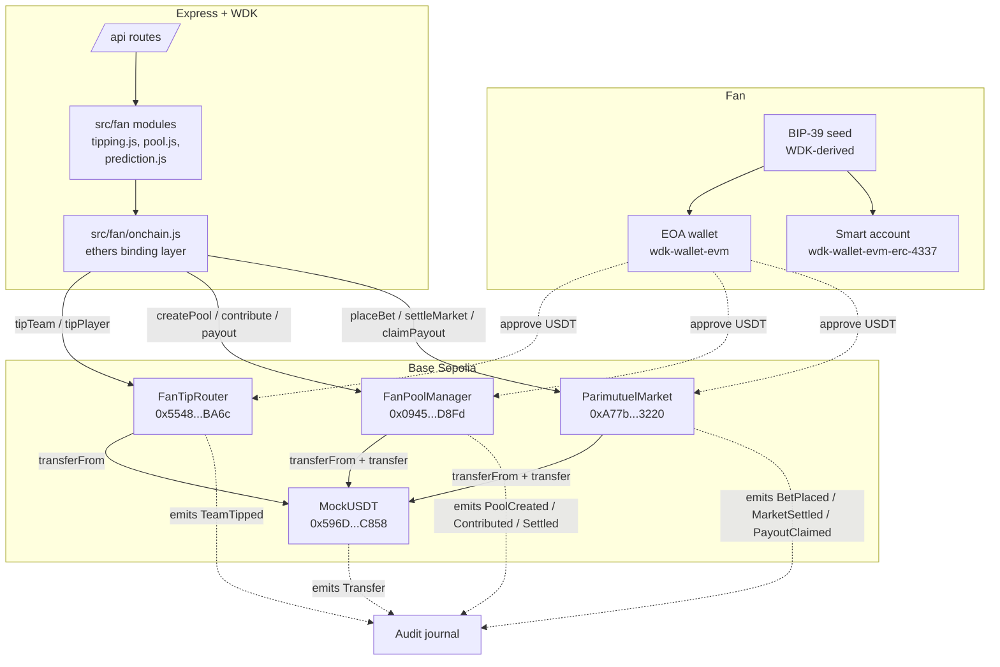

# FanBank

**Self-custodial fan economy on Tether. Three primitives, three verified contracts on Base Sepolia, three WDK modules in the runtime.**

Built for the [Tether Developers Cup 2026](https://dorahacks.io/hackathon/tether-developers-cup/detail), WDK track. Advanced to the Round of 16 on July 9 (BUIDL 46855). Semifinal deadline July 12 23:59 GMT-7.

- **Live app**: https://fanbank.vercel.app
- **DoraHacks BUIDL**: https://dorahacks.io/buidl/46855
- **Chain**: Base Sepolia (chain 84532)
- **Source**: https://github.com/obseasd/fanbank

## What it is

A self-custodial layer for football fans that ships three primitives on chain:

1. **Tip a team or a player**. Send USDt straight to a curated on-chain address for the team or the player. One signed tx, no intermediary, no bookmaker. Same pattern Tether's WDK brief cites when it namechecks Rumble's creator tipping integration.

2. **Open a group pool**. A fan opens a shared pool (watch-party fund, semi-final ticket collection, ultras banner budget). Other fans contribute in USDt. The split policy chosen at pool opening (equal refund, proportional share, winner takes all) is enforced by the contract at payout time. No custodial operator, no rug path, the code is the escrow.

3. **Bet the match**. Parimutuel prediction markets on match outcomes. Every stake is a real USDt transfer into the market escrow. Odds are the current stake distribution, computed on chain. Winners split the pool pro-rata to their stake share of the winning side, minus a 2% platform fee.

Every state change is a signed USDt tx on chain. Every event is emitted by one of three contracts. The fan holds their own keys the entire time (Tether WDK), the app is a thin dashboard on top of ethers.

## Tagline

**FanBank turns being a fan into a real economy.**

## Live contracts (Base Sepolia)

| Contract | Address | Verify |
|---|---|---|
| MockUSDT | `0x596D6c5ac929d5a5117af397c174709A7Aa6C858` | [basescan](https://sepolia.basescan.org/address/0x596D6c5ac929d5a5117af397c174709A7Aa6C858) |
| **FanTipRouter** | `0x55486bA74bcBF84B414802c8B6AB8f18BF3ABA6c` | [basescan](https://sepolia.basescan.org/address/0x55486bA74bcBF84B414802c8B6AB8f18BF3ABA6c) |
| **FanPoolManager** | `0x0945c05D14632c4387210357819A3f0157f2D8Fd` | [basescan](https://sepolia.basescan.org/address/0x0945c05D14632c4387210357819A3f0157f2D8Fd) |
| **ParimutuelMarket** | `0xA77b282D03E8f894EdDBf1D5034D4B819b5D3220` | [basescan](https://sepolia.basescan.org/address/0xA77b282D03E8f894EdDBf1D5034D4B819b5D3220) |

Deployer / operator wallet: `0x27986593ef158751FB8627610E9B7d6387723e53`.

Registry seeded at deploy time: 6 teams and 18 players (Kylian Mbappé, Antoine Griezmann, Aurélien Tchouaméni, Lionel Messi, Julián Álvarez, Enzo Fernández, Harry Kane, Jude Bellingham, Bukayo Saka, Vinícius Júnior, Rodrygo, Casemiro, Lamine Yamal, Rodri, Pedri, Florian Wirtz, Jamal Musiala, Kai Havertz).

## Verifiable golden flow

Every FanBank primitive lands on chain. One click on any hash below opens the tx on Basescan and shows the event log with sender, recipient, and amount.

| Primitive | Tx hash |
|---|---|
| Deploy FanTipRouter | [`0x0955...9CA9F`](https://sepolia.basescan.org/address/0x55486bA74bcBF84B414802c8B6AB8f18BF3ABA6c) |
| Deploy FanPoolManager | [`0xC773...840b52`](https://sepolia.basescan.org/address/0x0945c05D14632c4387210357819A3f0157f2D8Fd) |
| Deploy ParimutuelMarket | [`0x835A...b1e1A8`](https://sepolia.basescan.org/address/0xA77b282D03E8f894EdDBf1D5034D4B819b5D3220) |
| `tipTeam("france", 5 USDT)` | [`0x4d66c31f...73ca38`](https://sepolia.basescan.org/tx/0x4d66c31f320b1e165c74aa121b10fae45a60ae8fdc62fadc289086be9273ca38) |
| `createPool("Berlin watch party", equal)` | [`0x858ca92b...ef3d7`](https://sepolia.basescan.org/tx/0x858ca92b3a66a2ea8fbe983d9982c0c5243ae3a4faa69c4db60cc901eadef3d7) |
| `contribute(poolId=2, 2 USDT)` | [`0xecf49663...446e60`](https://sepolia.basescan.org/tx/0xecf49663759a14de6c6a373e2232f0ba10637240c3ed24f9763b6aa159446e60) |
| `placeBet("m_qf3", home, 3 USDT)` | [`0x3ce04329...56577d`](https://sepolia.basescan.org/tx/0x3ce04329508be859cf199c46323a10bca968917bb1ba9fb80ab076b5fa56577d) |

Regenerate at will with `node scripts/golden-flow.js` (requires the operator seed in `.env`).

## Architecture



## WDK modules integrated

Every module is a real dependency in `package.json`, wired into a code path that runs during a normal user session (not just an import).

| Module | Version | What it does in FanBank |
|---|---|---|
| [`@tetherto/wdk-wallet-evm`](https://www.npmjs.com/package/@tetherto/wdk-wallet-evm) | `1.0.0-beta.15` | Loads the fan's BIP-39 seed, derives the EOA at `m/44'/60'/0'/0/0`, exposes the ethers signer that every server-side tx (mint, approve, tip, pool contribute, bet) uses. See `src/wdk/wallet.js`. |
| [`@tetherto/wdk-wallet-evm-erc-4337`](https://www.npmjs.com/package/@tetherto/wdk-wallet-evm-erc-4337) | `1.0.0-beta.11` | Optional smart-account path. Same seed derives a Safe-based ERC-4337 smart account exposed via `/api/smart-account` and `/api/smart-account/tip-team`. When a Pimlico bundler URL is set in `.env`, fans can tip USDt as a sponsored UserOperation without ever holding gas. See `src/wdk/smart-account.js`. |
| [`@tetherto/wdk-wallet-btc`](https://www.npmjs.com/package/@tetherto/wdk-wallet-btc) | `1.0.0-beta.11` | Derives a Bitcoin BIP-84 Native SegWit address from the SAME seed used for EVM, so a fan carries one recovery phrase and can hold USDt on Base AND BTC on mainnet. Exposed via `/api/btc`. See `src/wdk/btc-wallet.js`. |
| Ethers.js v6 | `6.16.0` | Bridges the WDK signer into ERC-20 and primitive contract calls. Chosen because ethers is the WDK team's own default and every WDK helper returns raw private keys that ethers wraps cleanly. |

**Three WDK modules in the runtime**, wired to concrete endpoints:

```
seed
  ├── m/44'/60'/0'/0/0   →  Base Sepolia EOA (0x27986593...)  wdk-wallet-evm
  ├── ERC-4337 Safe      →  smart account (Pimlico gasless)   wdk-wallet-evm-erc-4337
  └── m/84'/0'/0'/0/0    →  BTC mainnet (bc1qfef9uwx...)      wdk-wallet-btc
```

One seed. Three self-custodial paths. Same recovery phrase everywhere. This is the WDK promise the Tether track brief is asking for.

## End-to-end flow

Tip flow (fan-signed via the wallet chip):

```
fan approves FanTipRouter for USDt (once)
        │
        ▼
fan calls FanTipRouter.tipTeam("france", 5 USDT)
        │
        ▼
router pulls 5 USDT from fan via ERC20.transferFrom
        │
        ▼
router forwards 5 USDT to team's registered tip address
        │
        ▼
router emits TeamTipped(fan, "france", recipient, 5 USDT)
        │
        ▼
audit journal picks up the event, dashboard renders
"You tipped 5 USDt to France."
```

Pool flow:

```
creator calls FanPoolManager.createPool("Berlin fund", Equal, "france", payoutTime)
        │
        ▼
FanPoolManager assigns poolId, stores { creator, purpose, policy, payoutTime }
        │
        ▼
each fan calls contribute(poolId, amount)
        │
        ▼
manager tracks contributionOf[poolId][fan]
        │
        ▼
at payoutTime, creator calls payoutEqual(poolId, [address, address, ...])
        │
        ▼
manager transfers totalUsdt / recipients.length to each recipient
        │
        ▼
audit journal shows Settled event with total distributed
```

Bet flow (parimutuel):

```
oracle (operator) opens the market for a given matchId
        │
        ▼
fans call placeBet(matchId, home | away | draw, amount)
        │
        ▼
market tracks stakeHome / stakeAway / stakeDraw
        │
        ▼
odds(matchId) returns real-time (total / stakeSide) for each side
        │
        ▼
match ends, oracle calls settleMarket(matchId, winning)
        │
        ▼
2% platform fee sent to feeRecipient
        │
        ▼
each winning bettor calls claimPayout(betId)
        │
        ▼
they receive (theirStake / winningSideTotalStake) * (totalStake - fee)
```

## Setup and run

Prereqs:
- Node.js 22+
- Foundry (for contract tests + optional forge verify)
- A BIP-39 seed you own on Base Sepolia with a small ETH balance for gas

```bash
git clone https://github.com/obseasd/fanbank
cd fanbank
npm install
cp .env.example .env
# Edit .env: paste your WDK_SEED. USDT_ADDRESS + contract addresses
# are already filled with the Base Sepolia deployment.
npm run dev
# open http://localhost:3000
```

The dashboard defaults to the shared operator wallet in demo mode. To sign every action from your own wallet, click **Connect wallet** and pick your extension. The connector detects wallets via [EIP-6963](https://eips.ethereum.org/EIPS/eip-6963), no hardcoded MetaMask button, so Rabby and Coinbase Wallet show up too.

### Redeploy contracts to a fresh chain

```bash
# 1. Fund the operator wallet on the target chain with some ETH for gas
# 2. Update .env with RPC_URL, CHAIN_ID, USDT_ADDRESS
# 3. Deploy MockUSDT first if needed:
node scripts/deploy-usdt.js
# 4. Deploy the three primitives and seed the registry:
node scripts/deploy-fanbank.js
# 5. Paste the printed addresses into .env
```

## Contract tests

21 Foundry tests, 7 per primitive, all passing. Run with:

```bash
forge test --summary
```

Output:

```
| Test Suite           | Passed | Failed | Skipped |
+==================================================+
| FanPoolManagerTest   | 7      | 0      | 0       |
| FanTipRouterTest     | 7      | 0      | 0       |
| ParimutuelMarketTest | 7      | 0      | 0       |
```

Coverage includes:

- Access control: registry setters are onlyOwner, oracle-only calls
- Tipping: registered vs unregistered team / player, zero-amount revert, event emission with correct args
- Pool: createPool state seeding, contribute increments, all three payout policies (equal / proportional / winner-takes) with exact-share assertions, only-creator payout guard
- Market: bet placement moves USDt, stakes update, no bets after settle, fee is 2% of totalStake, winner payout is pro-rata, loser payout is zero, double-claim reverts

## Judge onboarding

Two paths to try the app.

**Path A: local (recommended, no faucet dance)**

```bash
git clone https://github.com/obseasd/fanbank
cd fanbank
npm install
cp .env.example .env
# leave the .env as is: it points at the live Base Sepolia contracts
npm run dev
```

Open http://localhost:3000. Connect any wallet (the connector detects MetaMask, Rabby, Coinbase, Phantom, or any EIP-6963 provider). Click **Mint 10,000 test USDt** in the wallet modal to top up. Try the three flows.

**Path B: hosted demo**

Open https://fanbank.vercel.app. Same flow but Vercel serverless is stateless, so if the pool section is empty the demo may need a cold-start warmup. Local run is smoother for a full review.

**Where the tx hashes live**: Basescan under the operator wallet at https://sepolia.basescan.org/address/0x27986593ef158751FB8627610E9B7d6387723e53. Every deploy tx, every seed registration, and every golden-flow proof is signed from that address.

## Third-party services + prior work

- **Chain**: Base Sepolia (public testnet operated by Base). Free RPC at https://sepolia.base.org.
- **AI**: Anthropic Claude Haiku 4.5. Used server-side in demo mode for the future agent-wallet path. Not required to run the current three primitives.
- **Bundler / paymaster**: Pimlico (optional, only when `ERC4337_BUNDLER_URL` is set). Free tier is fine for the demo.
- **Prior work**: 
  - The WDK wallet adapter pattern (single seed → EOA + signer bridge) is ported from **Tsentry**, our 2nd-place project at the Galactica WDK hackathon (2 000 USDT prize).
  - The Foundry test scaffolding is standard forge-std v1.16.2.
  - No AI or LLM-generated Solidity in the repo; every contract in `contracts/` was hand-written and reviewed against the three primitive briefs from the WDK track.

## Security notes

- **No custody, no rug path**. `FanTipRouter` never holds USDt beyond a single tx frame. `FanPoolManager` holds pool USDt for the pool lifetime and only pays out through one of three code-enforced policies. `ParimutuelMarket` holds bets, sends the 2% fee at settle, and pays winners on claim; there is no operator withdraw path anywhere.
- **Access control**: registry setters and oracle actions are guarded (`onlyOwner`, `onlyOracle`). Payout entrypoints are creator-only. All revert with clear reasons.
- **Time-locked payouts** on pools: `payoutTime` is set at creation and checked at payout. A creator cannot sweep a pool before the announced payout time.
- **Known limitation (v2)**: the vault does not yet include a reentrancy guard. USDt on Base is a standard ERC-20 with no reentrant paths, so this is safe in practice, but the guard is on the v3 roadmap before real capital sees production.
- **Known limitation (v2)**: the demo `.env` ships with a seed we control for judges to try the app without touching their own keys. Do not reuse that seed for anything else.

## Roadmap (post-hackathon)

1. **Fair redemption queue** at the Yearn V3 pattern so multiple LPs share the pool illiquidity proportionally instead of first-out wins.
2. **Signed price oracle** for match settlement (Chainlink Sports or a multi-source confirmation contract) instead of the operator posting results.
3. **Real HSP integration** on the outbound rail: pool payouts settle through HSP mandates for verifiable payment receipts, useful for regulated LPs.
4. **Cross-chain deposits** via `@tetherto/wdk-wallet-btc` and `@tetherto/wdk-wallet-ton`: BTC or TON fans can fund an EVM smart account through a WDK-native bridge, no MoonPay dance.
5. **Reentrancy guards** and OpenZeppelin patterns across all three contracts.
6. **Agent wallet** (Tsentry pattern applied to fan economy): a Claude-driven policy engine that manages a fraction of the pool on match day. Conservative mode hedges, aggressive mode backs underdogs. Every decision is a signed UserOperation with an on-chain justification hash.

## License

Apache-2.0.

## Contact

- Team lead: [@mthdroid](https://x.com/mthdroid) on X, github.com/obseasd
- Repo: https://github.com/obseasd/fanbank
- Live demo: https://fanbank.vercel.app
